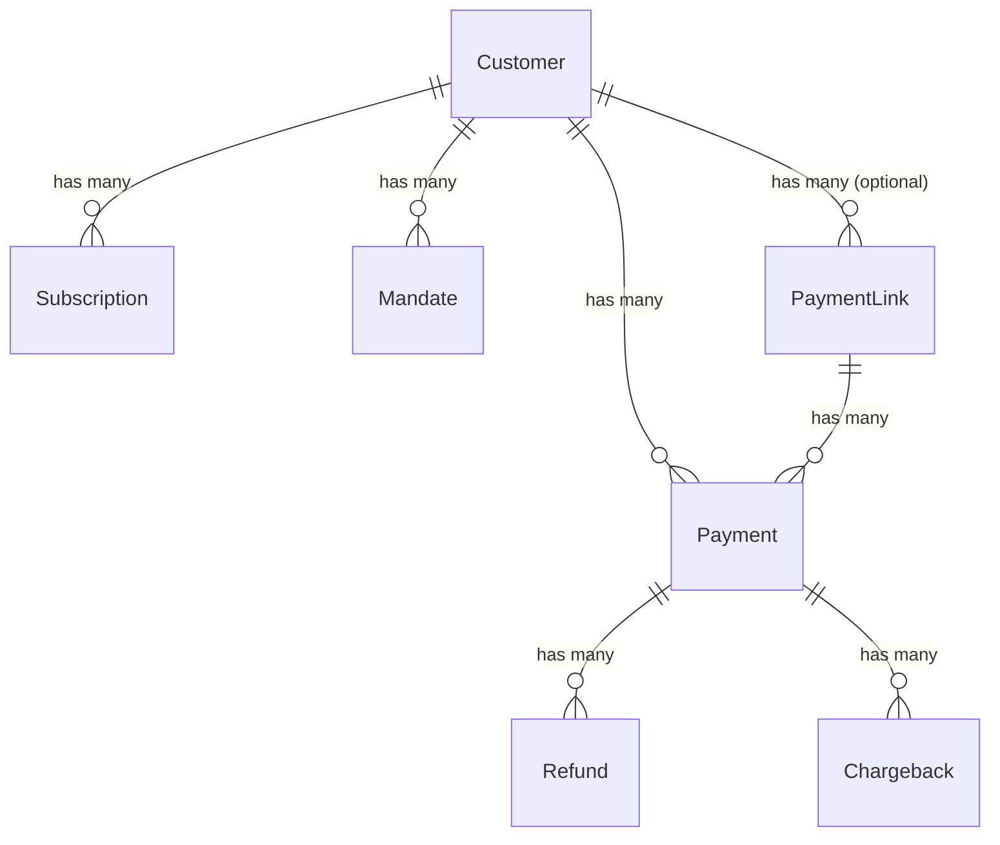

# Full Mollie API Support for MolliePay

## Enhancement Summary

**Deepened on:** 2026-03-17
**Review agents used:** Architecture Strategist, DHH Rails Reviewer, Kieran Rails Reviewer, Data Integrity Guardian, Security Sentinel, Performance Oracle, Code Simplicity Reviewer, Pattern Recognition Specialist, Best Practices Researcher, Framework Docs Researcher

### Key Changes from Review

1. **Phase 4 (Orders) removed** — e-commerce domain, not SaaS. If needed later, design as separate engine or major version.
2. **Phase 5 read-only wrappers removed** — zero value over direct `mollie-api-ruby` use. Document SDK usage instead.
3. **Payment Methods wrapper removed** — same rationale. Use `Mollie::Method.all` directly.
4. **`customer_id` nullable approach redesigned** — keep NOT NULL constraint; payment link payments route through PaymentLink for notification, not Billable.
5. **Chargeback detection extracted** into separate `SyncChargebacksJob` to keep `record_from_mollie` fast.
6. **Settlement model replaced** with `ActiveSupport::Notifications`-only approach (no AR model).
7. **Webhook regex** changed from fully permissive to extensible allowlist with length cap.
8. **`discard_on RecordNotFound`** refactored to be branch-specific instead of blanket.
9. **Ownership verification** added to all Billable methods that accept a payment argument.
10. **Payment link API** simplified to class method only (no dual Billable + class method).

---

## Overview

Expand MolliePay from its current 5-resource coverage (Customers, Payments, Subscriptions, Mandates, Refunds) to complete SaaS payment lifecycle support. The target: headless, simple, complete. The engine adds 2 new models (Chargeback, PaymentLink), core payment operations (captures, updates, cancellations), and settlement notifications — keeping the codebase at ~1200-1400 LOC.

**Explicitly out of scope:** Orders API (e-commerce domain), read-only API wrappers (use `mollie-api-ruby` directly), Mollie Connect/OAuth (separate plan when needed).

## Current State (v0.4.0)

| Resource | Status | Operations |
|---|---|---|
| Customers | ✅ | create, get |
| Payments | ✅ | create (oneoff/first/recurring), get |
| Subscriptions | ✅ | create, cancel, get |
| Mandates | ✅ | get (auto-created via first payment) |
| Refunds | ✅ | create, get |
| Webhooks | ✅ | tr_, sub_, re_ prefixes |

## Target State

Complete SaaS payment lifecycle across 4 implementation phases.

---

## Phase 1: Foundation & Webhook Infrastructure

**Why first:** Every subsequent phase depends on extensible webhook routing, the `authorized` payment state, and accurate amount tracking. This is the foundation that unblocks everything else.

### 1.1 Extend Webhook ID Prefix Routing

**Problem:** The current `MOLLIE_ID_FORMAT` regex `/\A(tr|sub|re)_[a-zA-Z0-9]+\z/` silently rejects all new resource types. Settlement webhooks (`stl_`) will be dropped with a 422 — silent data loss.

**Solution:**
- Change regex to an extensible allowlist: `/\A(tr|sub|re|stl)_[a-zA-Z0-9]{1,64}\z/`
- Add length cap (64 chars) to prevent queue abuse from extremely long strings
- Add routing for `stl_` prefix in `ProcessWebhookJob#perform`
- Add `else` clause that logs unknown prefixes via `Rails.logger.warn` (not silently dropped)
- Refactor `discard_on ActiveRecord::RecordNotFound` to be branch-specific (rescue in `sync_subscription` and `sync_refund` only, not blanket)

**Research Insights:**
- **Security:** A fully permissive regex (`/\A[a-z]{2,4}_/`) opens job queue saturation attacks. An attacker can POST arbitrary IDs that pass validation, each enqueuing a job. The allowlist keeps the controller as a strict gatekeeper.
- **Future-proofing:** New prefixes are added by updating the regex when adding support. This is a one-line change.
- **`discard_on` refactor is critical:** The blanket `discard_on RecordNotFound` will silently lose payment link payments (Phase 3) where `Customer.find_by!` fails on nil `customer_id`. Must be branch-specific before Phase 3 ships.

**Files:**
- `app/controllers/mollie_pay/webhooks_controller.rb`
- `app/jobs/mollie_pay/process_webhook_job.rb`
- `test/controllers/mollie_pay/webhooks_controller_test.rb`
- `test/jobs/mollie_pay/process_webhook_job_test.rb`

### 1.2 Payment `authorized` State Support

**Problem:** The `authorized` status exists in `Payment::STATUSES` but has no `authorized_at` timestamp, no hook, and no capture workflow. Klarna and other authorize-then-capture methods are unusable.

**Solution:**
- Add `authorized_at` column to `mollie_pay_payments`
- Add `on_mollie_payment_authorized` hook to Billable
- Set `authorized_at` in `Payment.record_from_mollie` on first observation
- Update `notify_billable` to fire the new hook

**Migration:**
```ruby
add_column :mollie_pay_payments, :authorized_at, :datetime
```

**Files:**
- `db/migrate/XXXXXX_add_authorized_at_to_mollie_pay_payments.rb`
- `app/models/mollie_pay/payment.rb`
- `app/models/mollie_pay/billable.rb`
- `test/models/mollie_pay/payment_test.rb`
- `test/models/mollie_pay/billable_test.rb`

### 1.3 Payment Amount Tracking Columns

**Problem:** Mollie provides `amountRefunded`, `amountRemaining`, `amountCaptured`, `amountChargedBack` on every payment object. Currently none are stored locally, requiring API calls for basic state checks.

**Solution:**
- Add `amount_refunded`, `amount_remaining`, `amount_captured`, `amount_charged_back` columns (all integer cents)
- Update `Payment.record_from_mollie` to populate them

**Migration:**
```ruby
add_column :mollie_pay_payments, :amount_refunded, :integer, default: 0
add_column :mollie_pay_payments, :amount_remaining, :integer
add_column :mollie_pay_payments, :amount_captured, :integer, default: 0
add_column :mollie_pay_payments, :amount_charged_back, :integer, default: 0
```

**Research Insights:**
- **`amount_remaining` uses nil-semantics intentionally.** `nil` = "never fetched from Mollie", `0` = "fully captured/refunded". This distinction matters for existing records that predate the column. Document on the model with a comment.
- **Handle absent API fields:** When `amountRemaining` is absent from Mollie's response (only present on certain statuses), leave the column nil rather than computing it. This keeps the data authoritative (from Mollie) rather than derived.
- **No indexes needed.** These are write-heavy, read-light tracking columns. Adding indexes would slow webhook processing with no query benefit.

**Files:**
- `db/migrate/XXXXXX_add_amount_tracking_to_mollie_pay_payments.rb`
- `app/models/mollie_pay/payment.rb`
- `test/models/mollie_pay/payment_test.rb`

### 1.4 Ownership Verification on Billable Methods

**Problem (Security):** All Billable methods that accept a `payment` argument (`mollie_refund`, and upcoming `mollie_capture`, `mollie_cancel_payment`, etc.) do not verify the payment belongs to the calling billable's customer. An attacker who controls one billable could pass another's payment.

**Solution:**
- Add ownership verification to the existing `mollie_refund` method
- Apply the same pattern to all new Billable methods in Phase 2
- Pattern: `raise MolliePay::Error, "payment does not belong to this customer" unless mollie_payments.exists?(id: payment.id)`

**Files:**
- `app/models/mollie_pay/billable.rb`
- `test/models/mollie_pay/billable_test.rb`

**Acceptance Criteria:**
- [x] Webhook regex uses extensible allowlist with length cap (64 chars)
- [x] Unknown webhook prefixes logged via `Rails.logger.warn`, not silently dropped
- [x] `ProcessWebhookJob` routes `stl_` prefix (initially to `ActiveSupport::Notifications`)
- [x] `discard_on RecordNotFound` is branch-specific, not blanket
- [x] `authorized_at` column exists and is set on first authorized observation
- [x] `on_mollie_payment_authorized` hook fires on Billable owner
- [x] Amount tracking columns populated from Mollie payment object
- [x] Ownership verification on `mollie_refund` and all future Billable methods
- [x] All existing tests pass unchanged

---

## Phase 2: Chargebacks, Captures & Payment Operations

**Why second:** These are the highest-value additions for SaaS apps. Chargebacks are the most urgent financial event. Captures enable Klarna/BNPL flows. Payment updates/cancellation complete the payment lifecycle.

### 2.1 Chargebacks Model

**Critical insight:** Mollie does NOT send separate chargeback webhooks. Chargebacks arrive embedded in the payment object via the `tr_` webhook. The payment status stays "paid" — only `amountChargedBack` changes. The current `previous_status` guard will never detect chargebacks.

**Solution:**
- New `MolliePay::Chargeback` model (`chb_` prefix IDs)
- `belongs_to :payment`, `has_many :chargebacks, dependent: :destroy` on Payment
- Detect chargebacks in `Payment.record_from_mollie` by comparing `amount_charged_back` before and after the `update!`
- When new chargeback amount detected, enqueue `SyncChargebacksJob` (separate from the payment update)
- `SyncChargebacksJob` fetches chargebacks from Mollie API via `Mollie::Payment::Chargeback.all(payment_id:)`, upserts local records, fires hooks
- Fire `on_mollie_chargeback_received(chargeback)` on Billable owner

**Schema:**
```ruby
create_table :mollie_pay_chargebacks do |t|
  t.string :mollie_id, null: false, index: { unique: true }
  t.references :payment, null: false, foreign_key: { to_table: :mollie_pay_payments }
  t.integer :amount, null: false
  t.string :currency, null: false, default: "EUR"
  t.json :reason   # Mollie returns a structured reason object
  t.datetime :mollie_created_at
  t.datetime :reversed_at
  t.timestamps
end
```

**Research Insights:**
- **Extract chargeback sync into a separate job.** The current `record_from_mollie` is a fast, single-record upsert (one DB write). Adding a synchronous Mollie API call + N chargeback upserts breaks this contract. A separate `SyncChargebacksJob` keeps `record_from_mollie` fast and lets chargeback syncing retry independently if the chargebacks endpoint fails.
- **Idempotency:** Use `find_or_initialize_by(mollie_id:)` with `RecordNotUnique` rescue, matching existing Subscription/Payment/Refund pattern.
- **`reason` as JSON, not string.** Mollie's chargeback reason is a structured object, not a plain string.
- **`currency` default.** Add `default: "EUR"` to match all existing table conventions.
- **Rename `created_at_mollie` to `mollie_created_at`.** The `mollie_` prefix is the established convention for Mollie-sourced attributes.
- **Detection pattern:**
  ```ruby
  # In Payment.record_from_mollie, after update!:
  previous_charged_back = record.amount_charged_back_before_last_save || 0
  if record.amount_charged_back > previous_charged_back
    SyncChargebacksJob.perform_later(record.id)
  end
  ```

**Files:**
- `db/migrate/XXXXXX_create_mollie_pay_chargebacks.rb`
- `app/models/mollie_pay/chargeback.rb`
- `app/models/mollie_pay/payment.rb` (extend `record_from_mollie` detection)
- `app/models/mollie_pay/billable.rb` (add hook)
- `app/jobs/mollie_pay/sync_chargebacks_job.rb`
- `test/models/mollie_pay/chargeback_test.rb`
- `test/models/mollie_pay/payment_test.rb`
- `test/models/mollie_pay/billable_test.rb`
- `test/jobs/mollie_pay/sync_chargebacks_job_test.rb`
- `lib/mollie_pay/test_fixtures/chargeback.json`

### 2.2 Captures

**Context:** Captures are synchronous — Mollie does NOT send webhooks for them. When a capture is created, the payment eventually transitions to "paid" via a `tr_` webhook. The SDK supports `Mollie::Payment::Capture.create(payment_id:, amount:)` via inherited `Base.create`.

**Solution:**
- Add `mollie_capture(payment, amount: nil)` to Billable
- Capture calls `Mollie::Payment::Capture.create(payment_id: payment.mollie_id, amount: mollie_amount)` directly
- If `amount` is nil, capture the full authorized amount
- Raise `MolliePay::CaptureNotAllowed` if payment is not in `authorized` status
- Add ownership verification: `raise ... unless mollie_payments.exists?(id: payment.id)`

**Research Insights:**
- **Keep on Billable, not Payment.** The existing pattern is all outbound API calls go through Billable (`mollie_refund`, `mollie_pay_once`, etc.). Consistency beats local elegance.
- **Race condition:** Two concurrent `mollie_capture` calls could both see `status == "authorized"`. Mollie's API will reject the second, but add a guard: check status locally before calling the API. For extra safety, consider `with_lock` on the payment row.

**Files:**
- `app/models/mollie_pay/billable.rb`
- `lib/mollie_pay/errors.rb` (add `CaptureNotAllowed`)
- `test/models/mollie_pay/billable_test.rb`

### 2.3 Payment Update & Cancel

**Solution:**
- Add `mollie_update_payment(payment, description: nil, redirect_url: nil, webhook_url: nil, metadata: nil)` to Billable
- Add `mollie_cancel_payment(payment)` to Billable
- Cancel raises `MolliePay::PaymentNotCancelable` if payment is not in a cancelable status
- Update works only on open/pending payments
- Both methods include ownership verification

**Files:**
- `app/models/mollie_pay/billable.rb`
- `lib/mollie_pay/errors.rb` (add `PaymentNotCancelable`)
- `test/models/mollie_pay/billable_test.rb`

**Acceptance Criteria:**
- [ ] Chargebacks detected from payment webhook via `amount_charged_back` comparison
- [ ] `SyncChargebacksJob` fetches and upserts chargebacks independently
- [ ] `on_mollie_chargeback_received(chargeback)` fires on Billable
- [ ] Chargeback model with mollie_id (unique), amount, currency (default EUR), reason (JSON)
- [ ] Chargeback upsert uses `find_or_initialize_by` + `RecordNotUnique` rescue
- [ ] `mollie_capture(payment)` creates capture via Mollie API with ownership check
- [ ] `CaptureNotAllowed` raised for non-authorized payments
- [ ] `mollie_update_payment` updates open/pending payments with ownership check
- [ ] `mollie_cancel_payment` cancels cancelable payments with ownership check
- [ ] `PaymentNotCancelable` raised for non-cancelable payments

---

## Phase 3: Payment Links

**Why third:** Payment links are one of Mollie's most-used features for invoicing. They don't require a customer, enabling a different use pattern than regular payments.

### 3.1 Payment Links Model

**Architecture decision (revised from review):** Payment links can be created without a customer (anonymous invoicing). However, **`customer_id` on payments stays NOT NULL.** Instead:

- Customer-linked payment links: the resulting payment gets a `customer_id` normally
- Anonymous payment links: the resulting payment is created WITHOUT going through `Payment.record_from_mollie`. Instead, `PaymentLink.record_payment_from_mollie` handles anonymous payments directly, persisting them on the PaymentLink via `payment_link_id`
- `notify_billable` is skipped for customer-less payments; instead `on_mollie_payment_link_paid` fires on the PaymentLink itself (using `ActiveSupport::Notifications`)

**Research Insights:**
- **Do NOT make `customer_id` nullable.** Multiple reviewers flagged this as the highest-risk change. `Payment.record_from_mollie`, `Refund.record_from_mollie`, `notify_billable`, and all `has_many :through` associations assume non-null. The blast radius is too large.
- **Alternative design:** Payment link payments with a customer work exactly like normal payments (the Mollie payment object has `customerId`). Anonymous payment link payments are a new code path in `ProcessWebhookJob` — when the fetched payment has no `customerId`, look for a matching PaymentLink and route there.
- **Single entry point:** `MolliePay.create_payment_link(amount:, description:, ...)` as a class method only. No Billable method. If a Billable wants a link, they pass `customer: mollie_customer`.
- **SDK note:** `Mollie::PaymentLink` has a custom `resource_name` returning `"payment-links"` (hyphenated). Be aware of this when constructing API calls.

**Schema:**
```ruby
create_table :mollie_pay_payment_links do |t|
  t.string :mollie_id, null: false, index: { unique: true }
  t.references :customer, foreign_key: { to_table: :mollie_pay_customers }
  t.integer :amount, null: false
  t.string :currency, null: false, default: "EUR"
  t.string :description
  t.string :status, null: false, default: "active"
  t.string :payment_link_url
  t.datetime :paid_at
  t.datetime :expires_at
  t.timestamps
end

# Add link back from payments to payment links (for customer-linked payment link payments)
add_reference :mollie_pay_payments, :payment_link,
  foreign_key: { to_table: :mollie_pay_payment_links }
```

**Webhook handling for anonymous payment link payments:**

In `ProcessWebhookJob#sync_payment`, after fetching the Mollie payment:
1. If `mp.customer_id` is present → existing `Payment.record_from_mollie` flow (unchanged)
2. If `mp.customer_id` is nil → check if payment has `_links.paymentLink`. If so, find the local `PaymentLink` and fire `ActiveSupport::Notifications.instrument("mollie_pay.payment_link_paid", payment_link: link, mollie_payment: mp)`
3. If no customer AND no payment link → log and discard (unknown origin)

**Files:**
- `db/migrate/XXXXXX_create_mollie_pay_payment_links.rb`
- `db/migrate/XXXXXX_add_payment_link_id_to_mollie_pay_payments.rb`
- `app/models/mollie_pay/payment_link.rb`
- `app/models/mollie_pay/payment.rb` (add optional `belongs_to :payment_link`)
- `app/jobs/mollie_pay/process_webhook_job.rb` (add anonymous payment path)
- `lib/mollie_pay.rb` (class-level `create_payment_link`)
- `test/models/mollie_pay/payment_link_test.rb`
- `test/jobs/mollie_pay/process_webhook_job_test.rb`
- `lib/mollie_pay/test_fixtures/payment_link.json`

**Acceptance Criteria:**
- [ ] PaymentLink model with CRUD operations
- [ ] `customer_id` on payments stays NOT NULL
- [ ] `MolliePay.create_payment_link(amount:, description:, customer: nil)` class method
- [ ] Customer-linked payment links: resulting payments flow through normal `record_from_mollie`
- [ ] Anonymous payment links: handled via separate code path in `ProcessWebhookJob`
- [ ] `ActiveSupport::Notifications` fires for anonymous payment link payments
- [ ] Payment gains optional `belongs_to :payment_link` association
- [ ] Tests for both customer-linked and anonymous payment link flows

---

## Phase 4: Settlement Notifications

**Why fourth:** Settlements are important for financial reconciliation. Mollie sends `stl_` webhooks. This is lightweight — no AR model, just webhook routing and notification.

### 4.1 Settlement Webhook Handling (No AR Model)

**Architecture decision (revised from review):** Settlements are account-level, not customer-level. They do not fit the Billable pattern. A full AR model adds migration, model file, tests, and a table for data the host app can fetch from Mollie directly. Instead: handle `stl_` webhooks with `ActiveSupport::Notifications` only.

**Solution:**
- `stl_` prefix in `ProcessWebhookJob` fetches `Mollie::Settlement.get(mollie_id)` and fires `ActiveSupport::Notifications.instrument("mollie_pay.settlement_received", settlement: mollie_settlement)`
- The host app subscribes in an initializer to react
- The `previous_status` guard pattern is applied: store the last-seen settlement status in `Rails.cache` keyed by `mollie_id` to avoid duplicate notifications on webhook replays

**Research Insights:**
- **Single notification mechanism.** The original plan had both `ActiveSupport::Notifications` AND a configurable `on_settlement` callback. DHH reviewer and simplicity reviewer both said: pick one. AS::Notifications is the Rails-standard answer.
- **Idempotency for callbacks:** Document that `mollie_pay.settlement_received` subscribers must be idempotent. Settlement webhooks can replay. Include settlement status in the notification payload so consumers can check `settlement.status == "paidout"` before acting.
- **Settlement amounts can be negative** (Mollie deducts fees). Document this for consumers.

**Files:**
- `app/jobs/mollie_pay/process_webhook_job.rb` (add `stl_` routing)
- `test/jobs/mollie_pay/process_webhook_job_test.rb`

**Acceptance Criteria:**
- [ ] `stl_` webhooks fetch settlement from Mollie API
- [ ] `ActiveSupport::Notifications` fires `mollie_pay.settlement_received`
- [ ] Notification includes full Mollie settlement object
- [ ] No AR model, no migration
- [ ] Documentation for host app subscription pattern
- [ ] Tests with WebMock stubs

---

## System-Wide Impact

### Interaction Graph

- `POST /mollie_pay/webhooks` → `WebhooksController#create` → `ProcessWebhookJob` → routes by prefix → `Model.record_from_mollie` → `notify_billable` → `owner.on_mollie_*`
- New: `tr_` with changed `amount_charged_back` → enqueues `SyncChargebacksJob` → fetches chargebacks → `on_mollie_chargeback_received`
- New: `tr_` with no `customer_id` → checks for PaymentLink → `ActiveSupport::Notifications`
- New: `stl_` → fetches settlement → `ActiveSupport::Notifications`

### Error Propagation

- All new Mollie API calls wrapped in existing `mollie-api-ruby` error handling
- New error classes: `CaptureNotAllowed`, `PaymentNotCancelable`
- All inherit from `MolliePay::Error`
- `ProcessWebhookJob` uses branch-specific `RecordNotFound` handling (not blanket `discard_on`)
- `SyncChargebacksJob` has its own retry logic (5 attempts, polynomial backoff)

### State Lifecycle Risks

- **Chargeback detection** enqueues a separate job, isolating failure from payment state updates
- **Payment link webhook** has a separate code path for anonymous payments — does not touch `record_from_mollie`
- **`customer_id` stays NOT NULL** — no migration risk on existing constraint

### API Surface

| Billable Method | Phase |
|---|---|
| `mollie_capture(payment, amount:)` | 2 |
| `mollie_update_payment(payment, ...)` | 2 |
| `mollie_cancel_payment(payment)` | 2 |

| MolliePay Class Method | Phase |
|---|---|
| `MolliePay.create_payment_link(...)` | 3 |

| New Hook | Phase |
|---|---|
| `on_mollie_payment_authorized` | 1 |
| `on_mollie_chargeback_received(chargeback)` | 2 |

| ActiveSupport::Notifications Event | Phase |
|---|---|
| `mollie_pay.payment_link_paid` | 3 |
| `mollie_pay.settlement_received` | 4 |

---

## ERD (New Models)



---

## Migration Summary

| Phase | Migration | Risk |
|---|---|---|
| 1 | `add_authorized_at_to_mollie_pay_payments` | Low — new nullable column |
| 1 | `add_amount_tracking_to_mollie_pay_payments` | Low — new columns with defaults |
| 2 | `create_mollie_pay_chargebacks` | Low — new table |
| 3 | `create_mollie_pay_payment_links` | Low — new table |
| 3 | `add_payment_link_id_to_mollie_pay_payments` | Low — new nullable FK |

---

## New Hooks & Notifications Summary

| Hook/Event | Phase | Trigger | Mechanism |
|---|---|---|---|
| `on_mollie_payment_authorized` | 1 | Payment enters authorized state | Billable hook |
| `on_mollie_chargeback_received(chargeback)` | 2 | Chargeback detected on payment | Billable hook |
| `mollie_pay.payment_link_paid` | 3 | Anonymous payment link paid | AS::Notifications |
| `mollie_pay.settlement_received` | 4 | Settlement webhook received | AS::Notifications |

---

## What Is NOT in This Plan

The following Mollie API resources are intentionally excluded. Host apps should use `mollie-api-ruby` directly for these:

| Resource | Why Excluded |
|---|---|
| **Orders API** | E-commerce domain, not SaaS billing. Different lifecycle (lines, shipments, fulfillment). |
| **Payment Methods** | Read-only listing. Use `Mollie::Method.all` / `Mollie::Method.all_available` directly. |
| **Balances** | Account-level read-only. Use `Mollie::Balance.all` directly. |
| **Invoices** | Mollie billing invoices. Use `Mollie::Invoice.all` directly. |
| **Profiles** | Account management. Use `Mollie::Profile.all` directly. |
| **Organizations** | Account info. Use `Mollie::Organization.get` directly. |
| **Terminals** | POS devices. Use `Mollie::Terminal.all` directly. |
| **Apple Pay Sessions** | Stateless validation. Use `Mollie::Client` to POST to wallets endpoint directly. |
| **Mollie Connect** | Requires per-request token passing through all models. Separate plan. Note: `Mollie::Client.with_api_key` block already supports this — less invasive than originally assumed. |

---

## Test Strategy

### AR Fixtures (test/fixtures/mollie_pay/)

- `chargebacks.yml` — references `acme_first` payment fixture
- `payment_links.yml` — one with customer, one without

### Mollie API Response Stubs (lib/mollie_pay/test_fixtures/)

- `chargeback.json` — single chargeback response
- `payment_link.json` — payment link response

### Test Helpers

- Add `stub_mollie_chargeback_list` and `webmock_mollie_chargeback_list` to `MolliePay::TestHelper`
- Add `stub_mollie_capture_create` and `webmock_mollie_capture_create`
- Add `stub_mollie_payment_link_create` and `webmock_mollie_payment_link_create`
- For SyncChargebacksJob, stub `Mollie::Payment::Chargeback.all` to return an array of OpenStruct objects

---

## SDK Reference (mollie-api-ruby v4.19.0)

Key SDK classes used by this plan:

| SDK Class | MolliePay Usage |
|---|---|
| `Mollie::Payment::Chargeback` | `SyncChargebacksJob` fetches via `.all(payment_id:)` |
| `Mollie::Payment::Capture` | `mollie_capture` creates via `.create(payment_id:, amount:)` (inherited from Base) |
| `Mollie::PaymentLink` | `MolliePay.create_payment_link` creates via `.create(...)` |
| `Mollie::Settlement` | Settlement webhook handler fetches via `.get(id)` |

**SDK gotchas:**
- `Mollie::PaymentLink` has custom `resource_name` returning `"payment-links"` (hyphenated)
- `Util.camelize_keys` only recurses for whitelisted keys (`:lines`, `:billing_address`, etc.)
- Per-request API keys: pass `api_key:` in any request, or use `Mollie::Client.with_api_key` block

---

## Sources

### Mollie API Reference
- Full API overview: https://docs.mollie.com/reference/overview
- Payments API: https://docs.mollie.com/reference/create-payment
- Captures API: https://docs.mollie.com/reference/create-capture
- Payment Links API: https://docs.mollie.com/reference/create-payment-link
- Settlements API: https://docs.mollie.com/reference/get-settlement
- Chargebacks API: https://docs.mollie.com/reference/get-chargeback

### Internal References
- Architecture: `AGENTS.md`
- Current models: `app/models/mollie_pay/`
- Webhook flow: `app/jobs/mollie_pay/process_webhook_job.rb`
- Billable concern: `app/models/mollie_pay/billable.rb`
- Configuration: `lib/mollie_pay/configuration.rb`

### External Research
- Pay gem chargeback handling: https://github.com/pay-rails/pay
- Stripe dispute patterns: https://docs.stripe.com/disputes/how-disputes-work
- Webhook idempotency: https://hookdeck.com/webhooks/guides/implement-webhook-idempotency
- mollie-api-ruby SDK source: https://github.com/mollie/mollie-api-ruby
