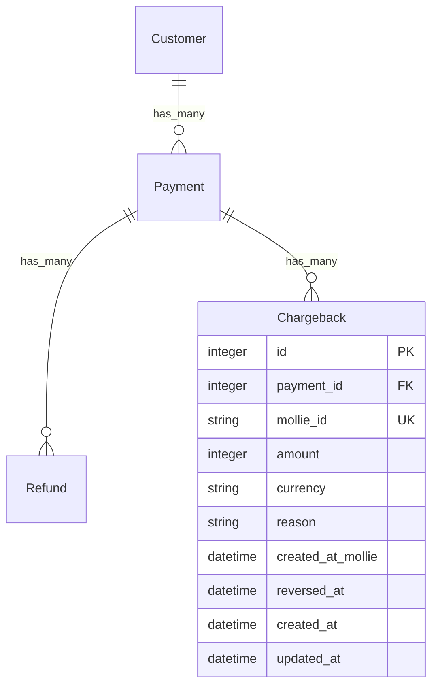

# feat: Add Chargeback model with detection via payment webhook

## Overview

Chargebacks are invisible in the current architecture. Mollie does NOT send separate chargeback webhooks — chargebacks arrive embedded in the payment object via `tr_` webhooks. The payment status stays "paid", only `amountChargedBack` changes. The current `previous_status` guard will never detect them.

This is a **critical business event** — chargebacks require immediate action (disable access, flag account, notify finance).

## Problem Statement

When a card issuer initiates a chargeback against a Mollie payment, Mollie updates the payment object's `amountChargedBack` field and fires the payment's webhook (`tr_` prefix). The current `Payment.record_from_mollie` syncs `amount_charged_back` to the local column but never inspects it for changes. There is no Chargeback model, no detection logic, and no hook to notify the host application.

## Proposed Solution

1. New `MolliePay::Chargeback` model with `record_from_mollie`
2. Detect chargebacks in `Payment.record_from_mollie` by comparing `amount_charged_back` before and after the update
3. When `amount_charged_back` **changes** (increase = new chargeback, decrease = reversal), delegate to `Chargeback.sync_for_payment(payment)` which fetches all chargebacks from Mollie API and upserts
4. Fire `on_mollie_chargeback_received(chargeback)` for each **new** chargeback
5. Fire `on_mollie_chargeback_reversed(chargeback)` when `reversed_at` changes from nil to a value

## Technical Approach

### Detection Mechanism

The key insight: chargeback detection cannot use the `previous_status` pattern because payment status doesn't change. Instead, compare `amount_charged_back` values.

In `Payment.record_from_mollie`:
```ruby
previous_amount_charged_back = payment.amount_charged_back
payment.update!(...)
if payment.amount_charged_back != previous_amount_charged_back
  Chargeback.sync_for_payment(payment)
end
```

### Chargeback Sync Strategy

`Chargeback.sync_for_payment(payment)` fetches **all** chargebacks for the payment from Mollie API, then upserts each one. This handles:
- First chargeback: creates new record, fires hook
- Additional chargebacks: existing ones are no-ops (already persisted), new ones created
- Reversals: existing records updated with `reversed_at`, fires reversal hook
- Idempotent replays: `find_or_initialize_by(mollie_id:)` ensures no duplicates

### Mollie API Call

```ruby
# mollie-api-ruby provides:
payment.mollie_record.chargebacks  # returns collection of chargeback objects
# Each chargeback has: id, amount, createdAt, reversedAt, reason, paymentId
```

### Hook Firing Logic

Since chargebacks have no status field, hook idempotency uses different signals:
- **New chargeback:** `new_record?` is true before save → fire `on_mollie_chargeback_received`
- **Reversed chargeback:** `reversed_at` changed from nil to a value → fire `on_mollie_chargeback_reversed`
- **Already processed:** record exists, no meaningful changes → no hook fires

## Schema

```ruby
create_table :mollie_pay_chargebacks do |t|
  t.references :payment, null: false,
    foreign_key: { to_table: :mollie_pay_payments }
  t.string :mollie_id, null: false, index: { unique: true }
  t.integer :amount, null: false
  t.string :currency, null: false, default: "EUR"
  t.string :reason
  t.datetime :created_at_mollie
  t.datetime :reversed_at
  t.timestamps
end
```

### ERD



## Implementation Phases

### Phase 1: Migration & Model

**Files to create:**
- `db/migrate/TIMESTAMP_create_mollie_pay_chargebacks.rb`
- `app/models/mollie_pay/chargeback.rb`

**Files to modify:**
- `app/models/mollie_pay/payment.rb` — add `has_many :chargebacks, dependent: :destroy`

The Chargeback model follows the Refund pattern (`app/models/mollie_pay/refund.rb`):
- `belongs_to :payment`
- `mollie_value_to_cents` for amount conversion
- `sync_for_payment(payment)` class method (fetches from Mollie API, upserts, fires hooks)
- No status column, no status constants (chargebacks don't have status transitions)
- Convenience predicates: `reversed?`

### Phase 2: Detection in Payment

**Files to modify:**
- `app/models/mollie_pay/payment.rb` — add chargeback detection in `record_from_mollie`

After `payment.update!(...)`, compare `amount_charged_back`:
```ruby
previous_amount_charged_back = payment.amount_charged_back
payment.update!(...)

# Existing status-change hook
payment.notify_billable if payment.status != previous_status

# New chargeback detection (orthogonal to status changes)
if payment.amount_charged_back != previous_amount_charged_back
  Chargeback.sync_for_payment(payment)
end
```

### Phase 3: Billable Hooks

**Files to modify:**
- `app/models/mollie_pay/billable.rb` — add no-op hook methods

```ruby
def on_mollie_chargeback_received(chargeback) ; end
def on_mollie_chargeback_reversed(chargeback) ; end
```

### Phase 4: Tests & Fixtures

**Files to create:**
- `test/fixtures/mollie_pay/chargebacks.yml`
- `test/models/mollie_pay/chargeback_test.rb`
- `lib/mollie_pay/test_fixtures/chargeback.json` (if needed for WebMock stubs)

**Files to modify:**
- `test/fixtures/mollie_pay/payments.yml` — add payment with `amount_charged_back: 500`
- `lib/mollie_pay/test_helper.rb` — add chargeback test stubs
- `test/models/mollie_pay/payment_test.rb` — test chargeback detection logic
- `test/jobs/mollie_pay/process_webhook_job_test.rb` — test chargeback detection via payment webhook

**Test scenarios:**
1. `sync_for_payment` creates new chargeback from Mollie data
2. `sync_for_payment` is idempotent — same chargeback not duplicated
3. `sync_for_payment` fires `on_mollie_chargeback_received` for new chargebacks only
4. `sync_for_payment` detects reversal and fires `on_mollie_chargeback_reversed`
5. `Payment.record_from_mollie` triggers sync when `amount_charged_back` changes
6. `Payment.record_from_mollie` does NOT trigger sync when `amount_charged_back` unchanged
7. Concurrent INSERT race handled by `RecordNotUnique` rescue
8. `reversed?` predicate returns correct values

### Phase 5: Documentation

**Files to modify:**
- `AGENTS.md` — add `chargeback.rb` to architecture diagram, add hooks to Billable section

## System-Wide Impact

- **Interaction graph:** `tr_` webhook → `ProcessWebhookJob` → `Payment.record_from_mollie` → `Chargeback.sync_for_payment` → `on_mollie_chargeback_received` on Billable owner. Two levels deep from existing webhook flow.
- **Error propagation:** If `Chargeback.sync_for_payment` raises (e.g., Mollie API error), it propagates up through `Payment.record_from_mollie` → `ProcessWebhookJob`, which has polynomial backoff (5 attempts). This is correct — the entire payment webhook should retry.
- **State lifecycle risks:** If the payment updates successfully but chargeback sync fails, the payment's `amount_charged_back` will be correct but no Chargeback record exists. On retry, the `amount_charged_back` comparison will be `N != N` (no change detected, since it was already persisted). **Mitigation:** Compare against the value *before* the `update!` call, captured in a local variable. On retry, the Mollie API will return the same payment data, the payment update will be a no-op, and the comparison will correctly detect no change. However, this means the chargeback fetch never retries. **Solution:** Always fetch chargebacks when `amount_charged_back > 0` and local chargeback count doesn't match expected count, OR capture `previous_amount_charged_back` before `update!` so the comparison works even on first run after the payment was already updated.
- **API surface parity:** No other interface exposes chargeback functionality. This is the only entry point.

## Design Decisions

1. **No `chb_` webhook routing** — Mollie sends chargebacks via `tr_` payment webhooks. No changes to `WebhooksController` or `ProcessWebhookJob` routing.
2. **No `mollie_chargebacks` through association on Billable** — Rails doesn't natively support nested through (Customer → Payment → Chargeback). Host apps can use `organization.mollie_payments.joins(:chargebacks)`.
3. **No status column** — Chargebacks don't have Mollie status transitions. `reversed_at` serves as implicit status indicator.
4. **`reason` as single string** — Store the human-readable description. Structured reason codes can be fetched from `mollie_record` if needed.
5. **Detect any `amount_charged_back` change** — Not just increases. This ensures reversals are also detected and `reversed_at` is populated.
6. **Add `on_mollie_chargeback_reversed` hook** — Reversed chargebacks are a materially different business event (money returned to merchant). Host apps that suspend accounts on chargeback need to know when to reinstate.

## Acceptance Criteria

- [ ] Migration creates `mollie_pay_chargebacks` table with correct schema
- [ ] `MolliePay::Chargeback` model with `belongs_to :payment`, `mollie_id` uniqueness
- [ ] `Payment` has `has_many :chargebacks, dependent: :destroy`
- [ ] `Chargeback.sync_for_payment(payment)` fetches from Mollie API and upserts
- [ ] `Payment.record_from_mollie` detects `amount_charged_back` changes and triggers sync
- [ ] `on_mollie_chargeback_received(chargeback)` fires on Billable owner for new chargebacks
- [ ] `on_mollie_chargeback_reversed(chargeback)` fires when `reversed_at` becomes non-nil
- [ ] Idempotent — same chargeback processed twice doesn't create duplicates
- [ ] `RecordNotUnique` rescue handles concurrent INSERT race
- [ ] `reversed?` predicate on Chargeback
- [ ] Test fixtures for chargebacks
- [ ] Test stubs in `TestHelper` for chargeback scenarios
- [ ] Chargeback detection tests in Payment model tests
- [ ] AGENTS.md updated with Chargeback in architecture diagram and hooks list

## Dependencies & Risks

- **Mollie API surface:** `mollie-api-ruby` must expose chargeback listing on payment objects. Need to verify `payment.chargebacks` returns the expected data structure.
- **Retry edge case:** If payment updates but chargeback sync fails mid-way, some chargebacks may be created while others aren't. The next webhook retry will re-detect the change and re-sync, so this is self-healing.

## Sources & References

- GitHub issue: #47
- Refund model (template): `app/models/mollie_pay/refund.rb`
- Payment model: `app/models/mollie_pay/payment.rb:25-58`
- Billable concern hooks: `app/models/mollie_pay/billable.rb:122-133`
- ProcessWebhookJob: `app/jobs/mollie_pay/process_webhook_job.rb`
- Amount tracking migration: `db/migrate/20260317194501_add_amount_tracking_to_mollie_pay_payments.rb`
