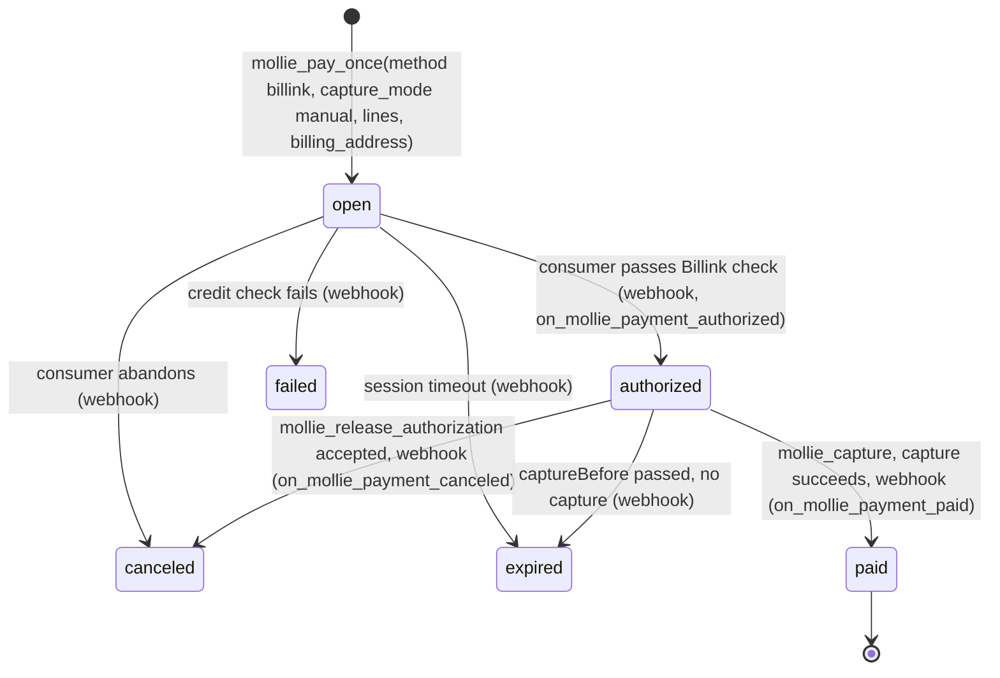
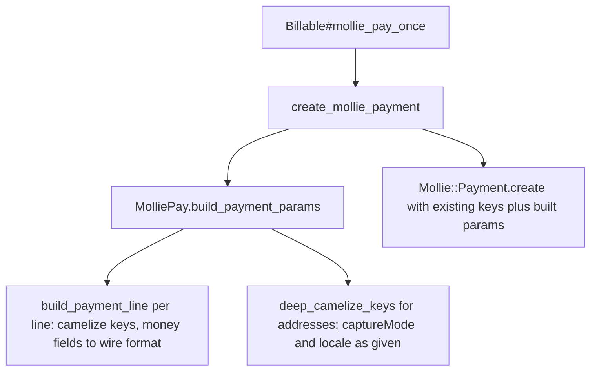

# Billink Pay-Later Payments - Plan

## Goal Capsule

- **Objective:** Let a host app create a Billink buy-now-pay-later payment through `MolliePay::Billable`, capture it after shipping, release it when the order is canceled, and receive the resulting status changes through the existing webhook flow.
- **Authority:** This plan, then `AGENTS.md`, then the Mollie API reference at https://docs.mollie.com/reference/create-payment and https://docs.mollie.com/docs/billink. When the plan and the Mollie docs disagree on a wire field, the Mollie docs win.
- **Execution profile:** Rails engine code, Minitest with fixtures and `Model.stub` blocks, WebMock. No new gems, no new tables, no views.
- **Stop conditions:** Stop and report if the mollie-api-ruby SDK rejects a nested hash shape the plan assumes, if a Mollie doc page contradicts the required-field list in R2 or R4, or if a change would require a new database column.
- **Tail ownership:** The calling pipeline owns simplification, review, commit, and PR.

---

## Product Contract

### Summary

Add Billink support to the engine. Billink is a Payments API method that requires order `lines`, a `billingAddress`, and manual capture. `mollie_pay_once` gains optional `lines:`, `billing_address:`, `shipping_address:`, `capture_mode:`, and `locale:` arguments. `Billable` gains a capture operation and a release-authorization operation. A Billink webhook fixture and documentation complete the feature. No new model or migration.

### Problem Frame

Mollie announced Billink on 2026-10-09. Billink consumers in the Netherlands, Belgium, and Germany receive the order first and pay within 14 days. Today `mollie_pay_once` can only send `amount`, `description`, `redirectUrl`, `method`, and `metadata`, so a Billink payment is rejected by Mollie for missing lines and billing address. The engine also has no way to capture an `authorized` payment, so even a successfully authorized Billink payment would expire after 28 days.

### Requirements

**Payment creation**

- R1. `mollie_pay_once` accepts `lines:`, `billing_address:`, and `shipping_address:` as optional keyword arguments and forwards them to Mollie Create Payment as `lines`, `billingAddress`, and `shippingAddress`. `mollie_pay_first` is unchanged.
- R2. Each line is a snake_case Ruby hash. The engine camelizes its keys and converts the money fields `unit_price`, `total_amount`, `vat_amount`, and `discount_amount` from `BigDecimal` to Mollie's `{ currency:, value: }` wire format. A money field that is already a wire-format hash passes through unchanged. Non-money fields (`vat_rate`, `quantity`, `description`, `type`, `sku`) are sent as given. The host supplies `total_amount` and `vat_amount` itself; the engine does not derive them.
- R4. Addresses are snake_case Ruby hashes. The engine camelizes their keys (`street_and_number` to `streetAndNumber`, and so on) and sends values unchanged.
- R5. `mollie_pay_once` accepts `capture_mode:` and `locale:` as optional keyword arguments and forwards them as `captureMode` and `locale`. No other Create Payment parameters are added. Existing callers that pass none of the new arguments see no change in the request sent to Mollie.
- R6. The engine does not infer `captureMode` from `method`. A host that creates a Billink payment passes `method: "billink"` and `capture_mode: "manual"` explicitly.

**Authorization lifecycle**

- R7. `mollie_capture(payment, amount: nil)` on `Billable` creates a capture for a payment the billable owns. It fetches the payment from Mollie and raises `MolliePay::PaymentNotAuthorized` when the live status is not `authorized`. When `amount` is nil, the capture omits `amount` so Mollie captures the full authorized amount. It returns the SDK capture object and does not change the local payment record.
- R7a. `MolliePay::Payment` gains `scope :authorized` so a host can list payments waiting for capture.
- R8. `mollie_release_authorization(payment)` on `Billable` asks Mollie to release the authorization of a payment the billable owns. It fetches the payment from Mollie and raises `MolliePay::PaymentNotAuthorized` when the live status is not `authorized`. It returns the SDK result and does not change the local payment record. Mollie processes the release asynchronously; the local status becomes `canceled`, `canceled_at` is set, and `on_mollie_payment_canceled` fires through the existing `tr_` webhook path.
- R9. Both operations verify payment ownership through the existing `verify_payment_ownership!` check and raise `MolliePay::Error` for a payment of another customer.

**Webhooks and testing**

- R10. A Billink payment that transitions `open` to `authorized` to `paid` through classic `tr_` webhooks fires `on_mollie_payment_authorized` once and `on_mollie_payment_paid` once, with `authorized_at` and `paid_at` set once each. A repeated webhook for the same status fires no hook. An `expired` webhook after `authorized` sets `expired_at` and fires `on_mollie_payment_expired`.
- R11. `MolliePay::TestHelper` gains `stub_mollie_capture_create(status: "authorized", **overrides)`, `fake_mollie_capture`, and `stub_mollie_payment_release_authorization(status: "authorized")` so host apps can test the new operations, including the not-authorized guard, without HTTP.
- R12. `lib/mollie_pay/test_fixtures/payment_billink.json` holds a camelCase Billink payment response with `method`, `captureMode`, `captureBefore`, `authorizedAt`, `billingAddress`, and `lines`, loadable through `webmock_mollie_payment_get`.

**Documentation**

- R13. README, `docs/api.md`, `docs/testing.md`, `docs/webhooks.md`, and `CHANGELOG.md` document the new arguments, the two operations, the new error, the new scope, the new test helpers, and the Billink-specific requirements: beta status that Mollie must activate on the account, manual capture, full capture only, EUR, 0.01 to 2500.00, and the 28-day authorization window.

### Key Decisions

- **Billink rides on the Payments API, not the Orders API.** Mollie no longer recommends the Orders API and documents Billink as a Payments API method with `lines` and `billingAddress` on the payment. Governs R1, R2, R4.
- **No local `method` or `capture_mode` column.** The engine stores only what business logic queries; capture eligibility is decided by Mollie's live status, which the operations fetch. Governs R7, R8.
- **The host passes `capture_mode: "manual"` explicitly.** The engine does not hold a per-method rule table that drifts from Mollie's docs. Governs R6.
- **Only the arguments Billink needs are added.** A generic Create Payment passthrough and engine-side derivation of line totals were considered and rejected: both widen the API and add validation the engine would have to keep in step with Mollie. Governs R2, R5.

### Scope Boundaries

- No new ActiveRecord model for captures. The payment becomes `paid` through the existing `tr_` webhook path.
- No handling of next-gen `capture.succeeded` or `capture.failed` events. `ProcessWebhookEventJob` keeps logging them. A failed capture leaves the payment `authorized`; the host sees it through `payment.mollie_record`.
- No local validation that line totals sum to the payment amount, or that `vatAmount` matches `vatRate`. Mollie returns a 422 with a precise message, and the local `Payment` row is rolled back by the existing transaction.
- No change to the webhook ID validation regex. Payment status changes caused by captures and releases arrive on the payment `tr_` id.
- No change to `mollie_pay_first`, subscriptions, or mandates. Billink does not support recurring payments.
- No local check that the configured currency is EUR. Mollie rejects a non-EUR Billink payment with a 422.

**Deferred to Follow-Up Work**

- A generic `**options` passthrough on payment creation (for `cancel_url`, `due_date`, and similar), with a reserved-key guard.
- Engine-side derivation of `total_amount` and `vat_amount` from `unit_price`, `quantity`, `discount_amount`, and `vat_rate`.
- Storing the payment method locally (a `payment_method` column, named to avoid `Object#method`) for scopes such as "all Billink payments".
- Storing `capture_before` locally so a host can query authorizations that expire soon. Until then the deadline is read from `payment.mollie_record.attributes["capture_before"]`; the SDK has no accessor for it.
- A `paid`-only guard on `mollie_refund`. A refund on an uncaptured authorization currently surfaces Mollie's own `Mollie::RequestError`.
- A `pending` transition timestamp and hook on `Payment`.
- Tutorial update in `docs/tutorial.md` showing a Billink checkout.

### Acceptance Examples

- AE1. **Covers R1, R2, R4, R5.** Given a billable with a Mollie customer, when it calls `mollie_pay_once` with `amount: BigDecimal("121.00")`, `method: "billink"`, `capture_mode: "manual"`, `locale: "nl_NL"`, `billing_address: { given_name: "Jan", family_name: "Jansen", street_and_number: "Keizersgracht 126", postal_code: "1015 CW", city: "Amsterdam", country: "NL", email: "jan@example.com" }`, and `lines: [ { description: "Widget", quantity: 1, unit_price: BigDecimal("121.00"), total_amount: BigDecimal("121.00"), vat_rate: "21.00", vat_amount: BigDecimal("21.00") } ]`, then `Mollie::Payment.create` receives `method: "billink"`, `captureMode: "manual"`, `locale: "nl_NL"`, `billingAddress: { givenName: "Jan", ..., streetAndNumber: "Keizersgracht 126", postalCode: "1015 CW", ... }`, and `lines: [ { description: "Widget", quantity: 1, unitPrice: { currency: "EUR", value: "121.00" }, totalAmount: { currency: "EUR", value: "121.00" }, vatRate: "21.00", vatAmount: { currency: "EUR", value: "21.00" } } ]`.
- AE2. **Covers R5.** Given an existing caller of `mollie_pay_once(amount:, description:, redirect_url:)`, when it runs after this change, then the keys sent to `Mollie::Payment.create` are exactly the keys sent today.
- AE3. **Covers R7.** Given an owned payment whose live Mollie status is `authorized`, when the billable calls `mollie_capture(payment)`, then `Mollie::Payment::Capture.create` receives `payment_id: payment.mollie_id`, no `amount` key, and an `idempotency_key`, and the local payment status is still `authorized`.
- AE4. **Covers R7.** Given an owned payment whose live Mollie status is `expired` (local status still `authorized` because the webhook is delayed), when the billable calls `mollie_capture(payment)`, then `MolliePay::PaymentNotAuthorized` is raised and no capture call is made.
- AE5. **Covers R8.** Given an owned payment whose live Mollie status is `authorized`, when the billable calls `mollie_release_authorization(payment)`, then the SDK release call is made with an `idempotency_key` and the local payment status and `canceled_at` are unchanged.
- AE6. **Covers R10.** Given a local `open` payment and a Billink webhook fixture with `status: "authorized"`, when `ProcessWebhookJob` runs twice for the same `tr_` id, then `on_mollie_payment_authorized` fires once and `authorized_at` is unchanged after the second run. When the fixture then returns `status: "paid"`, `on_mollie_payment_paid` fires once.

### Sources

- Billink method page: https://docs.mollie.com/docs/billink (method id `billink`, beta, activated by Mollie support or an account manager, EUR only, consumers NL/BE/DE, merchants NL/BE, 0.01 to 2500.00, 60-minute session, 28-day authorization, manual capture required, full capture only, full and partial refunds, no recurring).
- Create Payment reference: https://docs.mollie.com/reference/create-payment (`lines`, `billingAddress`, `shippingAddress`, `captureMode`, `locale`, address fields, line fields and formulas).
- Place a hold: https://docs.mollie.com/docs/place-a-hold-for-a-payment (`open` to `authorized` to capture to `paid`, `captureBefore`, expiry on missed capture).
- Release authorization: https://docs.mollie.com/reference/release-authorization (202 Accepted, processed asynchronously, success not guaranteed, payment becomes `canceled` when no capture succeeded).
- Create Capture: https://docs.mollie.com/reference/create-capture (201, capture `status` is `pending`, `succeeded`, or `failed`; `amount` optional, full amount when omitted).
- Capture webhooks: https://docs.mollie.com/reference/captures-api-webhooks (next-gen `capture.succeeded` and `capture.failed` events carrying the capture entity).
- Orders to Payments migration: https://docs.mollie.com/docs/migrating-from-orders-to-payments.
- Prior plan that scoped captures but never shipped them: `docs/plans/2026-03-17-004-feat-full-mollie-api-support-plan.md` (section 2.2).
- SDK pitfalls: `docs/solutions/integration-issues/mollie-chargeback-model-api-discovery.md` (SDK exposes only `attr_accessor` fields; fixtures must be camelCase).

---

## Planning Contract

### Key Technical Decisions

- KTD1. **Five explicit keyword arguments on `mollie_pay_once`, no passthrough.** `lines:`, `billing_address:`, `shipping_address:`, `capture_mode:`, and `locale:` are named in the signature, matching the existing explicit `method:` and `metadata:` style. A `**options` passthrough was rejected: it needs a reserved-key guard that is bypassable through camelCase or string spellings, and nothing Billink needs requires it. Governs R1, R5.
- KTD2. **A public `MolliePay.build_payment_params(lines:, billing_address:, shipping_address:, capture_mode:, locale:)` module function owns conversion.** It returns a camelized hash containing only the keys that were given, and `Billable#create_mollie_payment` splats it into `Mollie::Payment.create`. A private `build_payment_line` mirrors the existing `build_sales_invoice_line`, extended to the four money fields. The existing private `deep_camelize_keys` is reused. Chosen over doing conversion inside `Billable` because `lib/mollie_pay.rb` already owns wire conversion for sales invoices and the module function is unit-testable without a billable. It is public like `MolliePay.payment_methods` because `Billable` calls it from another module. Governs R2, R4, R5.
- KTD3. **The engine camelizes nested keys itself and never relies on the SDK allowlist.** `Mollie::Util.camelize_keys` recurses only into the keys `lines`, `recurring`, `billing_address`, and `shipping_address` (symbol or string). It does not recurse into `billingAddress`, and `create_mollie_payment` already sends camelCase top-level keys, so nested snake_case keys under them would reach the API unconverted. Fully camelized hashes are idempotent through the SDK. Governs R2, R4.
- KTD5. **One error class, `MolliePay::PaymentNotAuthorized`, guards both capture and release, and the guard reads Mollie's live status.** The local status lags the webhook, so a delayed `authorized` webhook would wrongly block a capture and a delayed `expired` webhook would wrongly allow one. Both operations fetch the payment with `Mollie::Payment.get` first, as `mollie_cancel_payment` already does. Chosen over the earlier plan's `CaptureNotAllowed` name because release has the same precondition. Governs R7, R8.
- KTD6. **Capture and release both return the SDK result and leave the local record alone.** Both are asynchronous on Mollie's side: a capture goes `pending` then `succeeded` or `failed`, and a release returns 202 with no success guarantee. A local status write would race the webhook, and a release that Mollie later fails would leave a wrong local `canceled` state that the next `authorized` webhook would then flip back, firing `on_mollie_payment_authorized` a second time. The `tr_` webhook path already sets `paid_at` or `canceled_at` once and fires the matching hook. This differs from `mollie_cancel_payment`, whose Mollie endpoint is synchronous and returns the canceled payment. Governs R7, R8.
- KTD7. **Capture and release each send a fresh idempotency key, like every other POST in the engine.** For release, the key is passed through `release_authorization`'s options hash, which the SDK forwards as the query argument and lifts into the `Idempotency-Key` header. A second full capture of the same payment is rejected by Mollie because no authorized amount remains. A host that times out on `mollie_capture` should check `payment.mollie_record.amount_captured` before retrying. Governs R7, R8.
- KTD8. **The Billink fixture is a separate file selected by a new `fixture:` keyword on `webmock_mollie_payment_get`.** Default stays `"payment"` so existing tests are untouched. Governs R12.

### High-Level Technical Design

Billink payment lifecycle as seen by the engine. Every local state change is driven by a Mollie webhook on the `tr_` id; the two host-initiated API calls only ask Mollie to act.

Request assembly for creation:

### Assumptions

- Payment status changes caused by captures and releases are announced on the payment's `tr_` classic webhook. Capture-level outcomes are only on next-gen `capture.*` events, which the engine does not process yet.
- Billink is available in test mode like Riverty and in3. Mollie's docs do not state this.
- The `mollie-api-ruby` SDK at 4.19.0 has no `Mollie::Method::BILLINK` constant. The engine passes the string `"billink"`; no constant is needed.
- `Mollie::Payment.delete` is not used for authorized payments; release-authorization is the documented path, so `mollie_cancel_payment` is left unchanged.
- Mollie's 202 release response carries a `{}` body, which the SDK parses and compares to `{}` to return `true`.

### Risks

- **Mollie 422 on line totals.** Lines whose `totalAmount` values do not sum to `amount`, or whose `vatAmount` does not match `vatRate`, are rejected by Mollie. The local `Payment` row is rolled back by the existing transaction. Documented in `docs/api.md` with the formulas the host must apply.
- **Authorization expiry.** A host that never calls `mollie_capture` sees the payment become `expired` after 28 days and receives `on_mollie_payment_expired`. Documented.
- **Release not honored.** Mollie does not guarantee a release succeeds. Because the engine writes nothing locally, the payment simply stays `authorized` and the host can retry or capture. Documented.
- **Fixture drift.** `payment_billink.json` is composed from `payment.json` plus the Create Payment response schema, not captured from a live call. Field names are checked against the docs during implementation.
- **Extra GET per capture and release.** The live-status guard costs one API call before the POST. Accepted for correctness, and it matches `mollie_cancel_payment`.
- **SDK accessor gaps.** `Mollie::Payment` has no `capture_before` or `capture_mode` accessor and `Mollie::Payment::Capture` has no `status` accessor. Docs point hosts at `attributes["capture_before"]` and `attributes["status"]`.

---

## Implementation Units

### U1. Payment parameter builder in the MolliePay module

**Goal:** A public `MolliePay.build_payment_params` that turns snake_case lines, addresses, capture mode, and locale into Mollie's camelCase wire shape with exact money conversion.

**Requirements:** R2, R4, R5. KTD2, KTD3.

**Dependencies:** none.

**Files:**
- `lib/mollie_pay.rb` (modify)
- `test/lib/mollie_pay/payment_params_test.rb` (create)

**Approach:**
1. Add `MolliePay.build_payment_params(lines: nil, billing_address: nil, shipping_address: nil, capture_mode: nil, locale: nil)` next to `create_sales_invoice`. It adds `captureMode` and `locale` only when given, deep-camelizes `billing_address` and `shipping_address` into `billingAddress` and `shippingAddress` only when given, and maps `lines` through a private `build_payment_line` only when given. The function is public and documented in `docs/api.md` (U5).
2. `build_payment_line` deep-camelizes the line and converts `unitPrice`, `totalAmount`, `vatAmount`, and `discountAmount` from `Numeric` to wire format with `configuration.currency`, leaving a wire-format hash untouched. No derivation.
3. Keep `deep_camelize_keys` private; the new public function is the only entry point.

**Patterns to follow:** `MolliePay.create_sales_invoice` and `build_sales_invoice_line` in `lib/mollie_pay.rb`; test shape in `test/lib/mollie_pay/sales_invoices_test.rb`.

**Test scenarios:**
- Covers AE1. A line with `unit_price: BigDecimal("121.00")`, `total_amount: BigDecimal("121.00")`, `vat_rate: "21.00"`, `vat_amount: BigDecimal("21.00")` yields `unitPrice`, `totalAmount`, and `vatAmount` in wire format and `vatRate: "21.00"` unchanged.
- A line with `discount_amount: BigDecimal("5.00")` yields `discountAmount` in wire format.
- A line whose `unit_price` is already `{ currency: "EUR", value: "10.00" }` passes through unchanged.
- A line with `quantity: 3`, `type: "physical"`, `sku: "W-1"` sends those values as given.
- `billing_address: { street_and_number: "A 1", postal_code: "1234 AB" }` yields `billingAddress: { streetAndNumber: "A 1", postalCode: "1234 AB" }`.
- `shipping_address:` yields `shippingAddress`.
- `capture_mode: "manual", locale: "nl_NL"` yields `captureMode` and `locale` keys.
- With no arguments the result is an empty hash.
- Nil `lines`, `billing_address`, `shipping_address`, `capture_mode`, or `locale` produce no key at all.

**Verification:** `bin/rails test test/lib/mollie_pay/payment_params_test.rb` passes; `bin/rubocop lib/mollie_pay.rb test/lib/mollie_pay/payment_params_test.rb` is clean.

### U2. Lines, addresses, capture mode, and locale on one-off payment creation

**Goal:** `mollie_pay_once` forwards the new parameters to Mollie without changing the request for existing callers.

**Requirements:** R1, R5, R6. KTD1.

**Dependencies:** U1.

**Files:**
- `app/models/mollie_pay/billable.rb` (modify)
- `test/models/mollie_pay/billable_test.rb` (modify)

**Approach:**
1. Extend `mollie_pay_once` and the private `create_mollie_payment` with `lines: nil, billing_address: nil, shipping_address: nil, capture_mode: nil, locale: nil`. `mollie_pay_first` passes nothing new.
2. In `create_mollie_payment`, splat `MolliePay.build_payment_params(lines:, billing_address:, shipping_address:, capture_mode:, locale:)` into the existing `Mollie::Payment.create` call before `idempotency_key`.
3. Leave the existing keys and their values untouched so AE2 holds.

**Patterns to follow:** The `received_args = nil; fake_create = ->(**args) { ... }` capture pattern around line 115 of `test/models/mollie_pay/billable_test.rb`.

**Test scenarios:**
- Covers AE1. `mollie_pay_once` with Billink arguments sends `method`, `captureMode`, `locale`, `billingAddress`, and converted `lines` to `Mollie::Payment.create`.
- Covers AE2. `mollie_pay_once` without new arguments sends exactly the existing key set (`amount`, `description`, `redirectUrl`, `webhookUrl`, `customerId`, `sequenceType`, `method`, `metadata`, `idempotency_key`).
- `mollie_pay_once` with `shipping_address:` sends `shippingAddress`.
- `mollie_pay_first` still sends exactly the existing key set.
- The local `Payment` record is still created with the given amount and `sequence_type` when lines are present.

**Verification:** `bin/rails test test/models/mollie_pay/billable_test.rb` passes with the existing tests unchanged.

### U3. Capture and release authorization on Billable

**Goal:** A host can complete or cancel an authorized Billink payment.

**Requirements:** R7, R7a, R8, R9, R11. KTD5, KTD6, KTD7.

**Dependencies:** U2 (shares `app/models/mollie_pay/billable.rb` and `test/models/mollie_pay/billable_test.rb`; run after U2 to avoid conflicting edits).

**Files:**
- `lib/mollie_pay/errors.rb` (modify)
- `app/models/mollie_pay/billable.rb` (modify)
- `app/models/mollie_pay/payment.rb` (modify: `scope :authorized`)
- `lib/mollie_pay/test_helper.rb` (modify)
- `test/models/mollie_pay/billable_test.rb` (modify)
- `test/models/mollie_pay/payment_test.rb` (modify: scope test)
- `test/lib/mollie_pay/test_helper_test.rb` (modify)
- `test/fixtures/mollie_pay/payments.yml` (modify: add an `acme_authorized` payment with `status: authorized`, `sequence_type: oneoff`, `authorized_at`)

**Approach:**
1. Add `PaymentNotAuthorized < Error` to `lib/mollie_pay/errors.rb`.
2. Add `mollie_capture(payment, amount: nil)` under the "Payments" section of `Billable`: `verify_payment_ownership!`, fetch `Mollie::Payment.get(payment.mollie_id)`, raise `PaymentNotAuthorized` unless the fetched payment is `authorized?`, build params `{ payment_id: payment.mollie_id, idempotency_key: SecureRandom.uuid }` plus `amount: mollie_amount(amount)` only when given, call `Mollie::Payment::Capture.create`, return its result.
3. Add `mollie_release_authorization(payment)`: same ownership check, fetch the live payment, same `authorized?` guard, call `release_authorization(idempotency_key: SecureRandom.uuid)` on the fetched object and return its result. No local write (KTD6).
4. Add `scope :authorized, -> { where(status: "authorized") }` to `Payment` next to the existing status scopes.
5. Add to `lib/mollie_pay/test_helper.rb`, following the existing stub and fake conventions and doc comments: `fake_mollie_capture(id: nil, payment_id: nil, amount: nil)` (the SDK `Mollie::Payment::Capture` has `id`, `amount`, `payment_id`, no `status`); `stub_mollie_capture_create(status: "authorized", **overrides, &block)`, which stubs `Mollie::Payment.get` with a fake payment whose `status` is the given value and whose `authorized?` is `status == "authorized"`, nested with a `Mollie::Payment::Capture.create` stub returning the fake capture; and `stub_mollie_payment_release_authorization(status: "authorized", &block)`, which stubs `Mollie::Payment.get` with a fake payment that has the same `status` and `authorized?` plus a `release_authorization` method accepting an options hash and returning `true`. Build these fake payments with `Object.new` and `define_singleton_method`, not `OpenStruct`: `OpenStruct` returns nil for `authorized?` and rejects arguments on `release_authorization`. Note in the doc comments that both helpers override `Mollie::Payment.get` for the whole block.

**Patterns to follow:** `mollie_refund` and `mollie_cancel_payment` in `app/models/mollie_pay/billable.rb`; `stub_mollie_refund_create` and `fake_mollie_refund` in `lib/mollie_pay/test_helper.rb`; the `cancelable?` fake in the cancel tests around line 905 of `test/models/mollie_pay/billable_test.rb`.

**Test scenarios:**
- Covers AE3. `mollie_capture(payment)` with a live `authorized` payment sends `payment_id` and `idempotency_key`, no `amount`, and leaves local status `authorized`.
- `mollie_capture(payment, amount: BigDecimal("50.00"))` sends `amount: { currency: "EUR", value: "50.00" }`.
- Covers AE4. `mollie_capture` when the live payment is `expired` raises `PaymentNotAuthorized` and `Mollie::Payment::Capture.create` is not called.
- `mollie_capture` when the live payment is `authorized` but the local record is still `open` succeeds (local status is not consulted).
- `mollie_capture` on a payment owned by another organization raises `MolliePay::Error` before any API call.
- `Payment.authorized` returns the `acme_authorized` fixture and not `acme_oneoff`.
- Covers AE5. `mollie_release_authorization(payment)` with a live `authorized` payment calls `release_authorization` with an `idempotency_key` and leaves local `status` and `canceled_at` unchanged.
- `mollie_release_authorization` when the live payment is `paid` raises `PaymentNotAuthorized`.
- `mollie_release_authorization` on a payment owned by another organization raises `MolliePay::Error` before any API call.
- `stub_mollie_capture_create` yields a capture with a `cpt_` id; with `status: "open"` the wrapped `mollie_capture` raises `PaymentNotAuthorized`. `stub_mollie_payment_release_authorization` lets `mollie_release_authorization` run without HTTP, and with `status: "paid"` it raises.

**Verification:** the full `bin/rails test` passes (the new `payments.yml` fixture row must not disturb other counts); `bin/rubocop` is clean on the changed files.

### U4. Billink webhook lifecycle fixture and job coverage

**Goal:** Prove the existing webhook path handles a Billink payment's `authorized`, `paid`, and `expired` transitions idempotently, using a fixture that matches Mollie's response shape.

**Requirements:** R10, R12. KTD8.

**Dependencies:** U3 (shares `lib/mollie_pay/test_helper.rb` and `test/lib/mollie_pay/test_helper_test.rb`).

**Files:**
- `lib/mollie_pay/test_fixtures/payment_billink.json` (create)
- `lib/mollie_pay/test_helper.rb` (modify: `webmock_mollie_payment_get(payment_id, fixture: "payment", **overrides)`)
- `test/lib/mollie_pay/test_helper_test.rb` (modify: `fixture:` keyword test)
- `test/jobs/mollie_pay/process_webhook_job_test.rb` (modify)

**Approach:**
1. Compose `payment_billink.json` from `payment.json` with `"method": "billink"`, `"status": "authorized"`, `"authorizedAt"`, `"captureMode": "manual"`, `"captureBefore"`, `"amountCaptured": { "value": "0.00", "currency": "EUR" }`, `"amountRemaining"`, a `"billingAddress"` with the seven required fields, and one physical `"lines"` entry with `unitPrice`, `totalAmount`, `vatRate`, `vatAmount`. All keys camelCase. Use synthetic names and addresses.
2. Add the `fixture:` keyword to `webmock_mollie_payment_get` with default `"payment"`.
3. Add job tests that seed a local `open` payment for the fixture's `tr_` id, run the webhook as `authorized`, again as `authorized`, then as `paid`, asserting timestamps are set once and hooks fire once per transition. Add a separate `authorized` then `expired` run.
4. Observe hooks at class level: `Payment.record_from_mollie` reloads the owner through `Customer.includes(:owner)`, so a singleton method on a test-local organization instance is never called. Define the hook on the dummy `Organization` class for the duration of the test (define, count calls, remove in `ensure`). This differs from `test/models/mollie_pay/chargeback_test.rb`, which can use `define_singleton_method` because `Chargeback.sync_for_payment` reuses the already-loaded owner.

**Patterns to follow:** `webmock_mollie_payment_get_with_chargebacks` in `lib/mollie_pay/test_helper.rb`; the `processes payment webhook` test in `test/jobs/mollie_pay/process_webhook_job_test.rb`; timestamp-once assertions in `record_from_mollie does not overwrite paid_at on duplicate webhook` in `test/models/mollie_pay/payment_test.rb`.

**Test scenarios:**
- Covers AE6. First `authorized` webhook moves the seeded `open` payment to `authorized`, sets `authorized_at`, and fires `on_mollie_payment_authorized` once.
- Second identical `authorized` webhook leaves `authorized_at` unchanged and fires no hook.
- A following `paid` webhook sets `paid_at`, keeps `authorized_at`, and fires `on_mollie_payment_paid` once.
- An `expired` webhook after `authorized` sets `expired_at` and fires `on_mollie_payment_expired`.
- `webmock_mollie_payment_get("tr_x", fixture: "payment_billink")` returns a body whose `method` is `billink` and whose `lines` parse through the SDK into `Mollie::Payment::Line` objects.

**Verification:** `bin/rails test test/jobs` passes and the fixture parses as JSON.

### U5. Documentation and changelog

**Goal:** A host developer can find how to create, capture, and release a Billink payment and how to test it.

**Requirements:** R13.

**Dependencies:** U1, U2, U3, U4.

**Files:**
- `README.md` (modify: add a Billink example after "One-off payment"; add `on_mollie_payment_authorized` to the hook example)
- `docs/api.md` (modify: add "Pay later with Billink" section after "Payment methods" covering the five new arguments, `MolliePay.build_payment_params`, the line formulas the host must apply (`totalAmount = unitPrice × quantity − discountAmount`, `vatAmount = totalAmount × vatRate / (100 + vatRate)`), capture with `amount` left nil because Billink allows full capture only, reading capture status from `capture.attributes["status"]`, release and that cancellation arrives through the webhook hook, the lifecycle, the beta activation prerequisite and limits, that refunds apply only after capture, and `mollie_record.attributes["capture_before"]` for the deadline; add `PaymentNotAuthorized` to the Errors table; add `Payment.authorized` to Scopes)
- `docs/testing.md` (modify: list the new stub helpers and the `fixture:` keyword)
- `docs/webhooks.md` (modify: one paragraph on the `authorized` state, capture, and release for BNPL methods)
- `CHANGELOG.md` (modify: new `## [Unreleased]` entry with `### Added`)

**Approach:** Write examples using `BigDecimal` amounts and snake_case hashes exactly as the Billable API accepts them. State Billink's constraints from the Sources section, including that code support does not enable Billink on a Mollie account. Do not bump `lib/mollie_pay/version.rb`; the release checklist in `docs/RELEASING.md` owns that.

**Patterns to follow:** The "Sales Invoices (beta)" sections in `README.md` and `docs/api.md`; the Keep a Changelog format already in `CHANGELOG.md`.

**Test scenarios:** Test expectation: none -- documentation only. Ruby snippets must match the implemented signatures.

**Verification:** Snippets in the docs match the method signatures in `app/models/mollie_pay/billable.rb` and `lib/mollie_pay.rb`.

---

## Verification Contract

| Gate | Command | Applies to |
|---|---|---|
| Unit and integration tests | `bin/rails test` | U1 to U4 |
| Focused model tests | `bin/rails test test/models/mollie_pay/billable_test.rb` | U2, U3 |
| Focused module tests | `bin/rails test test/lib` | U1, U3, U4 |
| Webhook job tests | `bin/rails test test/jobs` | U4 |
| Lint | `bin/rubocop` | all changed Ruby files |
| CI parity | `bin/rails db:test:prepare && bin/rails test` and `bin/rubocop -f github` | PR |

No migration is added, so `db/schema.rb` in the dummy app must be unchanged.

---

## Definition of Done

- All five units are implemented and the full suite passes with zero failures, errors, or skips added.
- `bin/rubocop` reports no offenses in changed files.
- Existing `mollie_pay_once` and `mollie_pay_first` callers produce the same Mollie request keys as before (AE2 test present and green).
- `MolliePay.build_payment_params`, `mollie_capture`, `mollie_release_authorization`, `Payment.authorized`, `PaymentNotAuthorized`, the three new test helpers, and the Billink fixture exist and are documented.
- No new gem, table, column, controller, or view.
- No abandoned experiment code remains in the diff.
